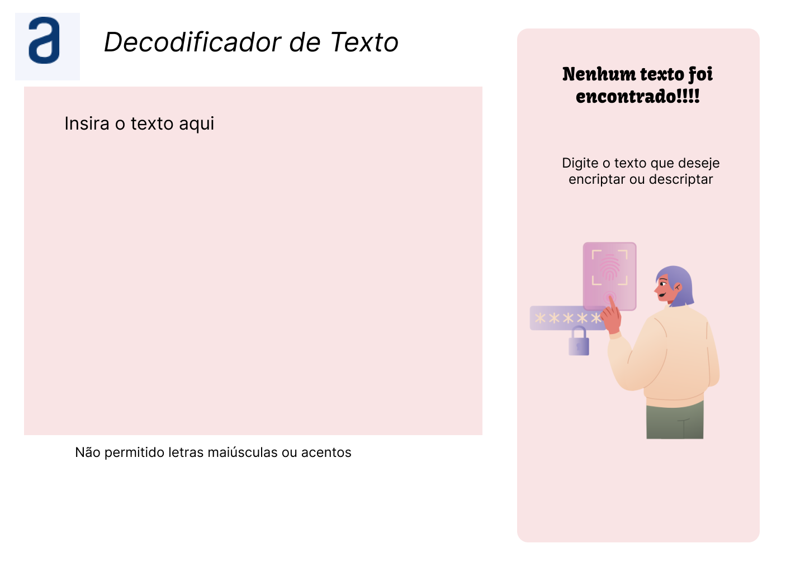
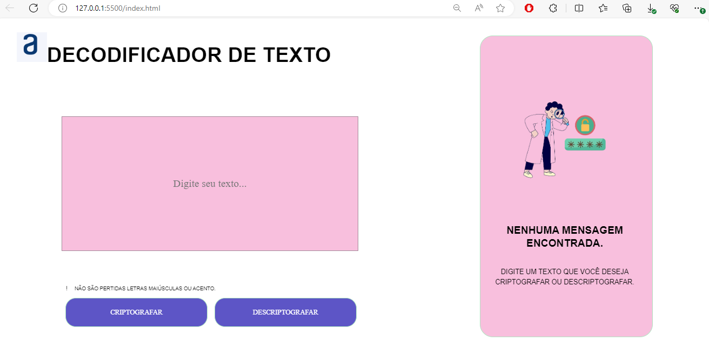

# DESAFIO DECODIFICADOR TURMA 6 ONE + ALURA

## Descrição do desafio
Este desafio visa construir um decodificador de texto utilizando JavaScript, HTML E CSS

Abaixo estão as imagens do exemplo criado no FIGMA e tela inicial

##

## Imagem do FIGMA

  
  

##

## Imagem do FIGMA

  
  

##
